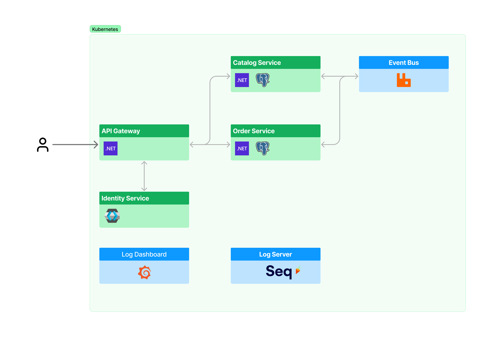
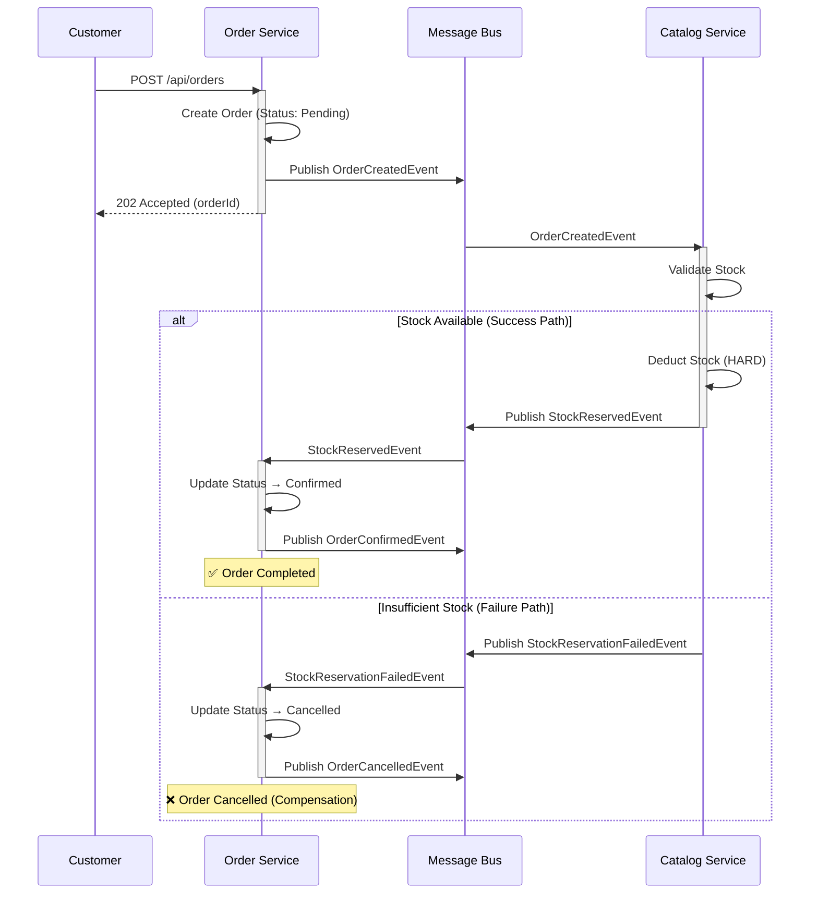
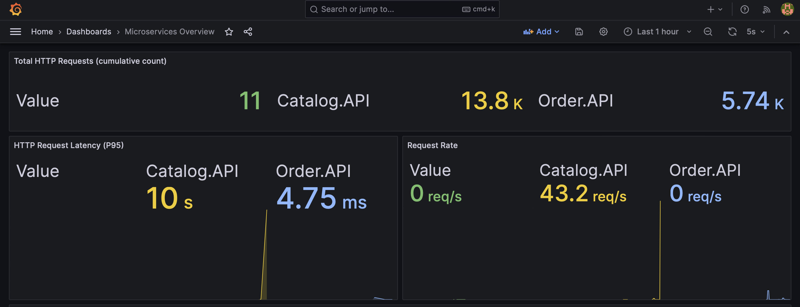
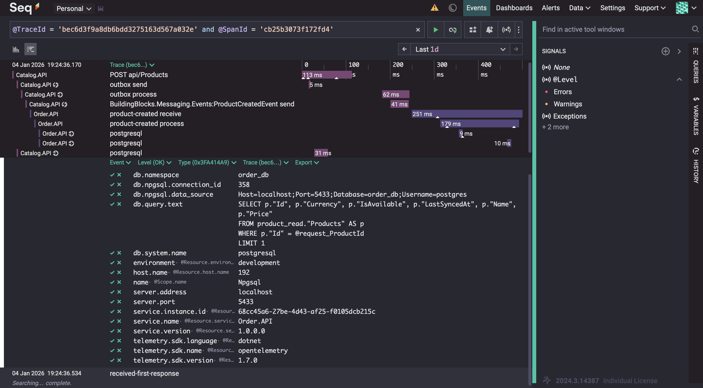

# Micro E-Commerce Platform

A production-ready **microservices e-commerce platform** built with .NET 10, demonstrating enterprise patterns including Clean Architecture, Domain-Driven Design, Event-Driven Choreography, and full observability.

---

## 🛠️ Tech Stack

| Category          | Technologies                                     |
| ----------------- | ------------------------------------------------ |
| **Backend**       | .NET 10, C# 13, .NET Core                        |
| **Architecture**  | Clean Architecture, DDD, CQRS                    |
| **Messaging**     | RabbitMQ, MassTransit (Inbox/Outbox Pattern)     |
| **Database**      | PostgreSQL with Entity Framework Core as ORM     |
| **API Gateway**   | YARP (Reverse Proxy, Rate Limiting, Routing)     |
| **Identity**      | Keycloak (OAuth 2.0 / OpenID Connect / JWT)      |
| **Observability** | OpenTelemetry, Prometheus, Grafana, Seq          |
| **Resilience**    | Polly (Retry, Circuit Breaker, Timeout)          |
| **Testing**       | xUnit, FluentAssertions, Testcontainers, NBomber |
| **DevOps**        | Docker                                           |

---

## 📐 Architecture



### Key Patterns & Practices

| Pattern                       | Implementation                                               |
| ----------------------------- | ------------------------------------------------------------ |
| **Clean Architecture**        | Domain-centric layers with strict dependency inversion       |
| **CQRS**                      | Command/Query separation via MediatR with pipeline behaviors |
| **Domain-Driven Design**      | Aggregates, Value Objects, Domain Events                     |
| **Event-Driven Choreography** | Decoupled services via RabbitMQ (no orchestrator)            |
| **Saga with Compensation**    | Stock reservation → Order confirmation / rollback            |
| **Transactional Outbox**      | MassTransit + PostgreSQL for guaranteed delivery             |
| **Database per Service**      | Independent data stores for service autonomy                 |
| **Event Sourcing**            | Product read models synced via domain events                 |

---

## 🔐 Authentication & Authorization

**Keycloak** provides centralized identity management with OAuth 2.0 / OpenID Connect.

| Configuration | Value                                             |
| ------------- | ------------------------------------------------- |
| **Realm**     | `microservices`                                   |
| **Clients**   | `catalog-service`, `order-service`, `api-gateway` |
| **Roles**     | `catalog-admin`, `order-admin`, `customer`        |
| **Port**      | 8080                                              |

JWT tokens are validated at the API Gateway, propagating claims to downstream services via correlation headers.

---

## 🔄 Event-Driven Saga Flow

Order placement follows a **choreography-based saga pattern** with automatic compensation:



**Key Characteristics:**
- **No Orchestrator**: Services react to events autonomously
- **Transactional Outbox**: Guaranteed message delivery via PostgreSQL
- **Idempotency**: Events processed exactly once via MassTransit Inbox
- **Compensation**: Automatic rollback on failure

---

## 🔭 Observability

Full observability stack with **OpenTelemetry** for distributed tracing, metrics, and structured logging.



| Component                   | Purpose                                | Port       |
| --------------------------- | -------------------------------------- | ---------- |
| **OpenTelemetry Collector** | Telemetry aggregation & export         | 4317, 4318 |
| **Prometheus**              | Metrics storage & querying             | 9090       |
| **Grafana**                 | Dashboards & alerting                  | 3000       |
| **Seq**                     | Structured logging & trace correlation | 8081       |



### Custom Metrics

| Metric                                               | Description                         |
| ---------------------------------------------------- | ----------------------------------- |
| `microcommerce_mediatr_request_duration`             | MediatR handler latency (histogram) |
| `microcommerce_mediatr_requests_total`               | Request count by handler & status   |
| `microcommerce_http_server_request_duration_seconds` | HTTP endpoint performance           |

---

## 🧪 Testing Strategy

Comprehensive testing with **80%+ code coverage** target.

| Test Type             | Tools                                 | Purpose                             |
| --------------------- | ------------------------------------- | ----------------------------------- |
| **Unit Tests**        | xUnit, FluentAssertions, NSubstitute  | Domain logic & handlers             |
| **Integration Tests** | Testcontainers, WebApplicationFactory | API & database verification         |
| **Load Tests**        | NBomber                               | Performance (100-500 RPS scenarios) |
| **Chaos Tests**       | Simmy, Polly                          | Fault injection & resilience        |

```bash
# Run all tests with coverage
dotnet test --collect:"XPlat Code Coverage"

# Generate coverage report
reportgenerator -reports:"**/coverage.cobertura.xml" -targetdir:"TestResults/CoverageReport"
```

---

## 🚀 Quick Start

### Prerequisites
- .NET 10 SDK
- Docker & Docker Compose

### Run with Docker

```bash
# Start all services
docker-compose -f docker-compose.dev.yml up -d

# Access points
# API Gateway:  http://localhost:5000
# Catalog API:  http://localhost:5100
# Order API:    http://localhost:5200
# Keycloak:     http://localhost:8080 (admin/admin)
# Grafana:      http://localhost:3000 (admin/admin)
# Seq:          http://localhost:8081
# RabbitMQ:     http://localhost:15672 (guest/guest)
```

### Run Locally

```bash
# Start infrastructure
docker-compose -f docker-compose.dev.yml up -d

# Run services
dotnet run --project src/Services/Catalog/Catalog.API
dotnet run --project src/Services/Order/Order.API
dotnet run --project src/ApiGateway/Gateway
```

---

## 📁 Project Structure

```
├── src/
│   ├── ApiGateway/Gateway/              # YARP reverse proxy + Keycloak auth
│   ├── BuildingBlocks/
│   │   ├── BuildingBlocks.Common/       # Base entities, Value Objects, Exceptions
│   │   ├── BuildingBlocks.Messaging/    # Event contracts, MassTransit filters
│   │   └── BuildingBlocks.Observability/ # OpenTelemetry setup
│   └── Services/
│       ├── Catalog/
│       │   ├── Catalog.Domain/          # Product, Category aggregates
│       │   ├── Catalog.Application/     # CQRS handlers, validators
│       │   ├── Catalog.Infrastructure/  # EF Core, MassTransit consumers
│       │   └── Catalog.API/             # REST endpoints
│       └── Order/                       # Same Clean Architecture layers
├── tests/
│   ├── Catalog.UnitTests/
│   ├── Catalog.IntegrationTests/
│   ├── Order.UnitTests/
│   ├── Order.IntegrationTests/
│   ├── LoadTests/                       # NBomber performance scenarios
│   └── ChaosTests/                      # Simmy fault injection
└── infrastructure/
    ├── k8s/                             # Kubernetes manifests
    ├── keycloak/                        # Realm export configuration
    ├── grafana/                         # Dashboard provisioning
    ├── prometheus/                      # Scrape configs & alerts
    └── otel/                            # Collector configuration
```

---

## 📄 License

MIT
